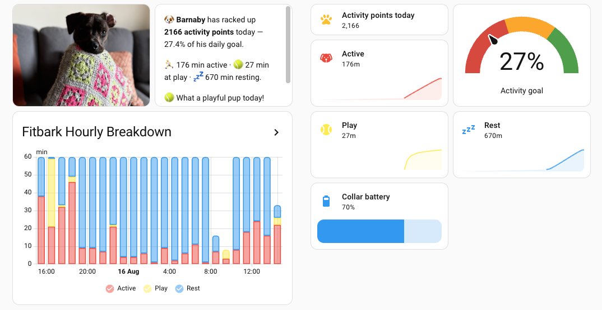
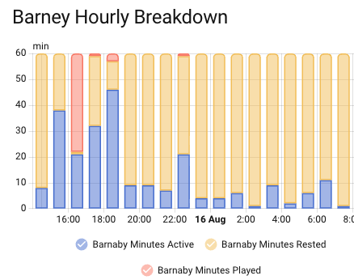

# FitBark for Home Assistant

A HACS-installable custom integration that exposes [FitBark](https://www.fitbark.com/)
dog activity tracker data as Home Assistant sensors.

**Not affiliated with or endorsed by FitBark.**



## What this does (and doesn't)

Per dog, this integration exposes:

- Activity points earned today, and progress toward the daily goal
- Active / play / rest minute breakdown
- Collar battery level

It does **not** expose location, sleep score, or FitBark's computed health index --
these are not available through the public developer API.

## Prerequisites (manual, one-time)

Register a developer app at the [FitBark developer portal](https://www.fitbark.com/dev/)
   to get a `client_id` and `client_secret`.


## Installation

To install in your Home Assistant instance you'll need [Home Assistant Community Store (HACS)](https://www.hacs.xyz/) installed

1. **Add the custom repository to HACS**
   - Open **HACS** in the sidebar → **⋮** (top right) → **Custom repositories**
   - Repository: `https://github.com/saubury/ha-fitbark`, category **Integration**, Add
2. **Install FitBark**
   - In HACS, search **FitBark** → Download, then restart Home Assistant when prompted
3. **Add Application Credentials**
   - **Settings → Devices & Services → Add**
   - Pick **FitBark**, enter the `client_id`/`client_secret` from the prerequisite step
4. **Add the integration**
   - **Settings → Devices & Services → Add Integration** → search **FitBark**
   - Complete the browser OAuth step (log into your FitBark account)
5. **Verify**
   - Each dog appears as its own device with the 6 sensors 
   - **Developer Tools → Statistics** starts backfilling hourly activity/play/active/rest
     data (the initial 42-day backfill takes a few seconds)
   - Optionally, **Configure** the integration to adjust the two polling intervals


## How it works

Endpoint paths, HTTP methods, and field names are taken from FitBark's official v2
Postman API documentation and confirmed against a live account. A single
`GET /api/v2/dog_relations` call returns every owned dog's current snapshot in one
shot -- activity points, the goal in effect today, the active/play/rest minute
breakdown, and a `battery_level` field -- so a full update cycle is exactly one HTTP
request regardless of how many dogs are on the account. This isn't documented by
FitBark (the official docs show battery nowhere at all), but has been verified live.

The daily-goal percentage shown by `activity_goal_percent` is computed client-side
(`activity_value / daily_goal * 100`), since FitBark's own response doesn't include a
percentage directly.

### Hourly activity history (long-term statistics)

In addition to the current-snapshot sensors above, each dog's hourly activity is
imported into Home Assistant's long-term statistics (the same mechanism used by energy
and utility integrations), visible under **Developer Tools → Statistics** or in a
Statistics Graph card. Four statistics are imported per dog, one per metric FitBark
returns per hour:

| Statistic ID suffix | Name | Unit |
|---|---|---|
| `_activity` | `<Dog name> Activity` | BarkPoints |
| `_minutes_play` | `<Dog name> Minutes Played` | min |
| `_minutes_active` | `<Dog name> Minutes Active` | min |
| `_minutes_rest` | `<Dog name> Minutes Rested` | min |

This uses `POST /api/v2/activity_series` at `HOURLY` resolution, which FitBark caps to
a 7-day range per call, so a wide backfill (42 days on first setup) is split into
consecutive 7-day windows automatically -- one shared fetch per dog covers all four
metrics, since each hourly record already carries all of them. After the initial
backfill, it refreshes hourly on its own schedule, independent of the 5-minute sensor
polling. 

To see the play/active/rest **proportion of each hour** (each hour's three minute
values sum to 60), add all three minute statistics to one card:



```yaml
type: statistics-graph
title: Fitbark Hourly Breakdown
days_to_show: 1
period: hour
chart_type: bar-stack
stat_types:
  - change
entities:
  - fitbark:<dog_slug_with_underscores>_minutes_play
  - fitbark:<dog_slug_with_underscores>_minutes_active
  - fitbark:<dog_slug_with_underscores>_minutes_rest
```


## API call volume

FitBark doesn't publish a rate limit, so this integration is deliberately conservative
and every schedule is easy to see and adjust:

- **Sensor entities**: one `GET /api/v2/dog_relations` call per poll, covering every dog
  on the account in a single request. Default interval is **1 hour** (~24 calls/day),
  configurable from **Settings → Devices & Services → FitBark → Configure** anywhere from
  15 minutes to 12 hours. FitBark's collar sync isn't continuous, so polling much faster
  than the default mostly just re-fetches unchanged values.
- **Hourly statistics** (see below): one `POST /api/v2/activity_series` call per dog per
  cycle once backfilled, default every **1 hour** (~24 calls/day/dog), also configurable
  in the same Configure dialog, from 1-24 hours -- going below 1 hour has no benefit,
  since FitBark's finest tracked resolution is hourly. Separately, a
  one-time-ever 42-day backfill (up to 6 calls per dog) happens the first time a dog's
  statistics are created.


## Development

```bash
pip install -r requirements_test.txt
pytest tests/
```

### Testing against a local dev Home Assistant instance

If you run `hass` locally (e.g. `hass -c ./dev_config`) rather than through
`my.home-assistant.io`-reachable remote access, the account-linking step will fail with
*"Invalid state. Is My Home Assistant configured to go to the right instance?"* This
happens because `default_config:` hard-depends on the `my` integration, which always
routes the OAuth callback through `my.home-assistant.io` -- and that service has no way
to bounce a browser back to a bare `localhost` instance it's never seen before.

Fix: don't use `default_config:` in your dev `configuration.yaml`; load only what you
need instead (this avoids pulling in `my`):

```yaml
frontend:
config:
http:
application_credentials:
```

Then also register the direct local callback with FitBark, alongside your other
redirect URIs (see the `curl` snippet above, adding
`http://localhost:8123/auth/external/callback` to the `redirect_uri` string).
